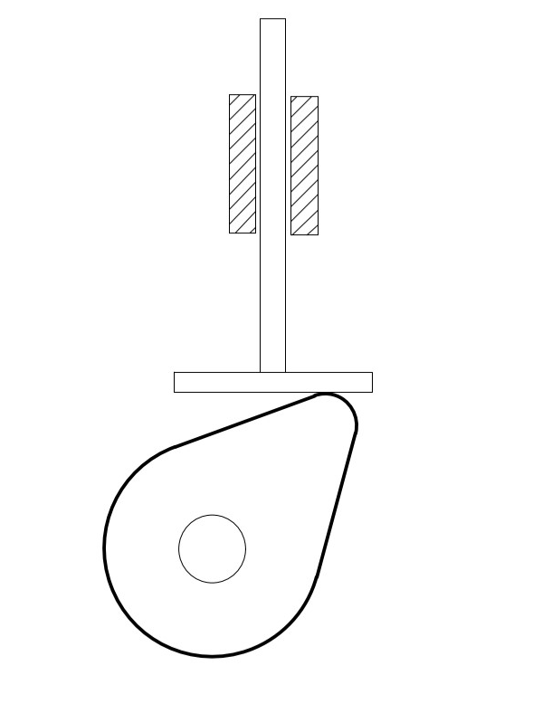
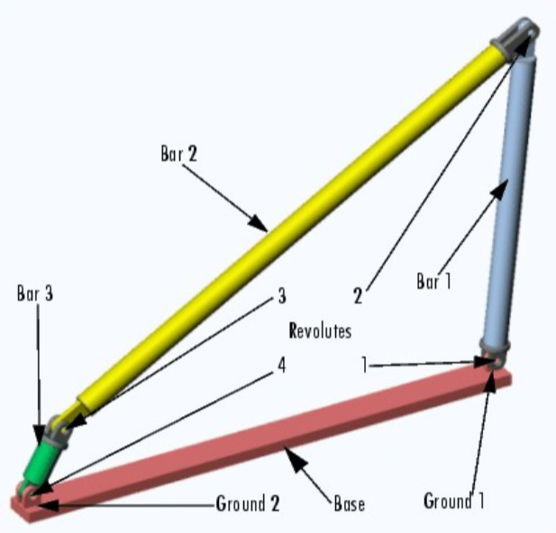

# CH_1

[TOC]

## Overall Purpose

- Synthesis of mechanisms to accomplish desired motions or tasks
- Analysis of mechanisms to determine their rigid-body dynamic behavior
- The above relates to kinematics and kinetics

### Synthesis:

the composition or combination of parts or elements so as to form a whole

### Analysis:

a detailed examination of anything complex in order to understand its nature or to determine its essential features

### Kinematics:

the study of motion **without** regard of forces

### Kinetics:

the study of forces in motion

## Mechanisms and Machines

### Machine:

transfer energy

### Mechanism:

transfer movement

> _Bar_
> any member which are subjected to axial (Tensile/Compressive but no Transverse/Torsional loads) loads only

### Mechanism types

- 3 bar mechanism

- 4 bar mechanism

## Degree of freedom (mobility)

the number of independent parameters to uniquely define system position in space has 6 DOF

### Links:

- Binary link: one with two nodes
- Ternary link: one with three nodes
- Quaternary link: one with four nodes

#### Types of Links:

- **Crank**: a link that makes a complete revolution and is pivoted to the ground
- **Rocker**: a link that has oscillatory (back and forth) rotation and is pivoted to ground
- **Coupler (Connecting rod)**: a link that has complex motion and is not pivoted to ground
- **Ground**: any link or links that are fixed (nonmoving) with respect to the reference frame

### Joints:

a connection between two or more links (at their nodes). Joints also called Kinematic pairs

#### Types of Joints:

- **Lower pair**: an ideal joint that constrains contact between a surface in the moving body to a corresponding surface in the fixed body
- **Higher pair**: a constraint that requires a curve in the moving body to maintain with a curve or surface in the fixed body

_Joints may be form closed or force closed_
