# Chapter 11

[TOC]

## Introduction

The general function of any machine is to **transmit motion and forces** to the components that perform the desired task

During the design of a machine, determining the driving forces is critical. In many cases, the **torque** required to operate the system is the main attribute in the actuator selection process.

## 11.1 Graphical Method

### Inertia Force

$$
F_O = -m A
$$

Note: the inertia force acts in the **opposite** direction to the acceleration

and it's based on the acceleration of the centre of gravity of the link

### Inertia Torque

$$
I_O = -I\alpha
$$

Note: the inertia torque is in the opposite direction to the angular acceleration

and it's based on the angular acceleration of the link

### Force & Moment Balance

#### Statics

1. $\sum\text{Forces} = 0$
2. $\sum\text{Moments} = 0$
3. 二力反向等大
4. 三力汇交一点
5. 力偶作用与施加位置无关

#### Dynamic

- Case 1: Pure Translation
  
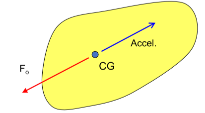

    $$
    F_O = - mA_{CG}
    $$

- Case 2: Pure Rotation about C.G.
  
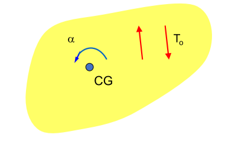

    $$
    T_O = -I\alpha
    $$

- Case 3: Curvilinear Plane Motion
  
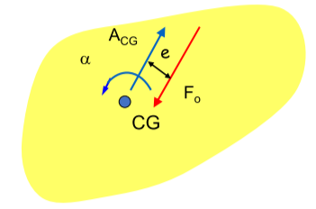

  $$
  F_O = -mA_{CG}\\[2ex]
  T_O = -I\alpha \\[2ex]
  e = \frac{I\alpha}{F_O}
  $$

### Superposition Method

#### Steps in the Analysis

1. 算出个各杆件加速度及质心加速度
2. 利用质心加速度算出内力大小
3. 取出一杆，画受力图
4. 利用内力大小和三力汇交一点原则解出未知力
5. 记录剩余力对其余杆件的影响
6. 杆件上的力矩即由上述力产生
7. 取其他杆重复 3-6 的操作，直至所有杆件分析完毕

#### Example

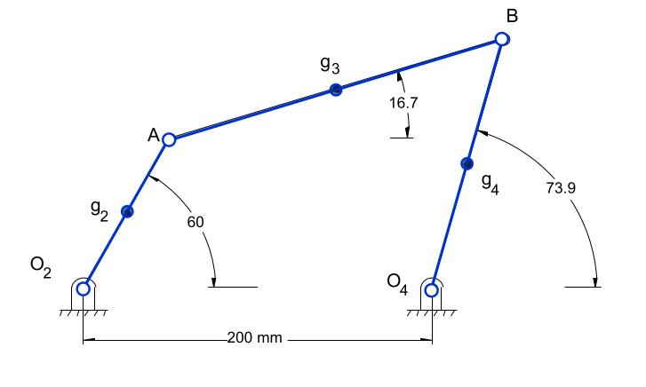

| link | length | mass |   I    |
| :--: | :----: | :--: | :----: |
|  2   |  100   | 0.5  | 0.0005 |
|  3   |  200   | 1.0  | 0.004  |
|  4   |  150   | 0.75 | 0.002  |

1. 利用作图法求出各点的加速度, 各连线的中点的加速度即为质心的加速度
    
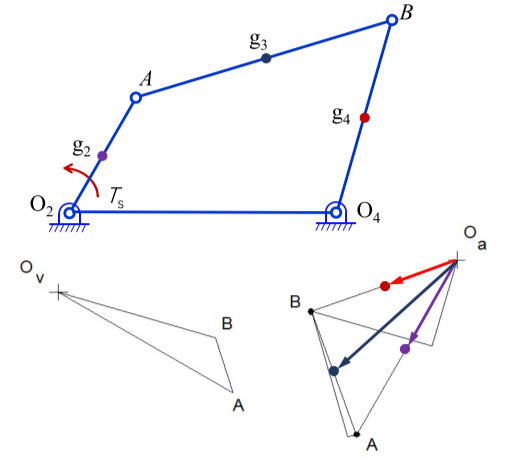

2. 利用上图求出杆件上的内力以及偏移距离
    
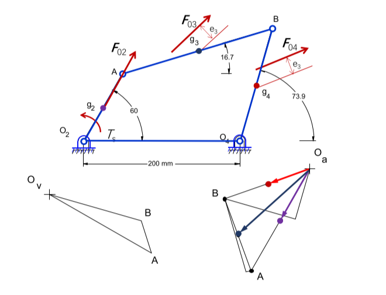

3. 选取杆4做分析，画出受力图
    
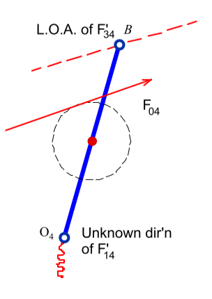

4. 可以发现只有$F'_{14}$未知方向和大小，利用三力汇交原则， 确定了各个力的大小和方向 
    
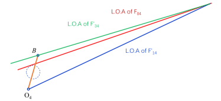

5. 将剩余力施加到杆2、3上
    
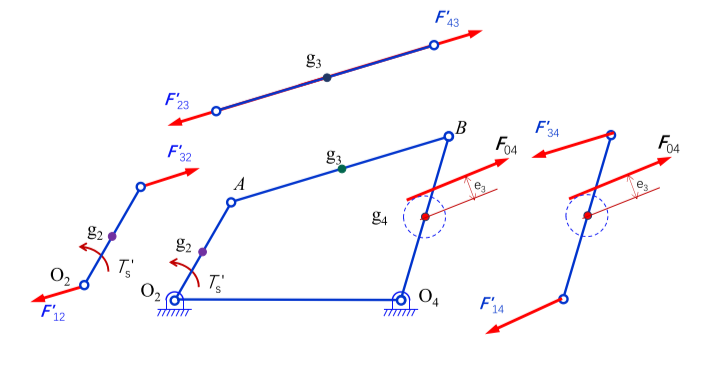

6. 取杆件3做分析，画出受力图
    
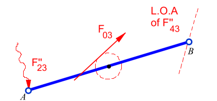

7. 发现只有$F''_{23}$未知大小和方向，利用三力汇交原则，确定各个力的大小和方向
    
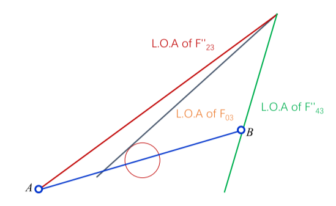

8. 将剩余力施加到杆2上
    
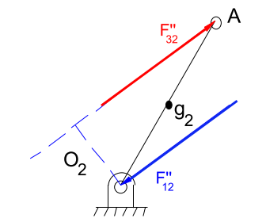

9. 取杆2分析，发现其只受到内力作用，取其内力的反向等大的力为$F'''_{12}$
10. 将各点上的剩余力叠加，得到各点受力大小和方向
    |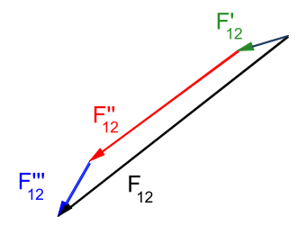|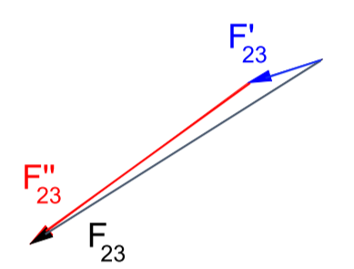|
    |:--:|:--:|
    |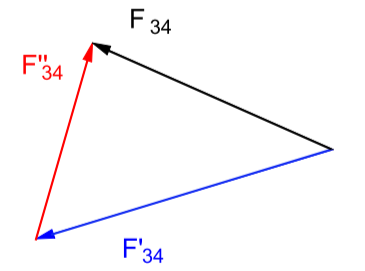|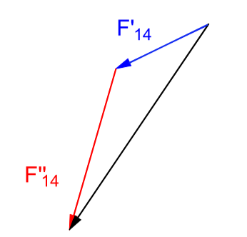|

## 11.2 Analytical Method of Superposition

### Notes

it's not necessary to offset the inertia force in this method

instead the sum forces and moments equal to 0 equations are developed and solved simultaneously for the unknowns, considering links on at a time again

### Example

| link | length | mass |   I    |
| :--: | :----: | :--: | :----: |
|  2   |  100   | 0.5  | 0.0005 |
|  3   |  200   | 1.0  | 0.004  |
|  4   |  150   | 0.75 | 0.002  |

1. 利用上表和图中条件给出各杆件的运动速度和加速度，并且算出内力和扭矩
2. 选取杆4作为研究对象，利用合转矩为0计算出$F'_{34}$的大小，利用合力为零计算得出$F'_{14}$
3. 计算剩余力对2、3杆件的影响
4. 选取杆3作为研究对象，同样利用合转矩为0计算出$F''_{34}$的大小，再利用合力为0计算得出$F''_{23}$
5. 计算其对杆件2的影响
6. 取杆件2，利用合力为0计算得出$F'''_{12}$的大小
7. 各杆件上的力相加得出结果

## 11.3 Matrix Method

nah, whatever

咕咕咕咕