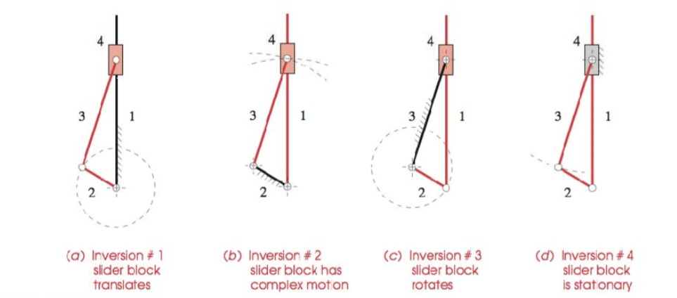
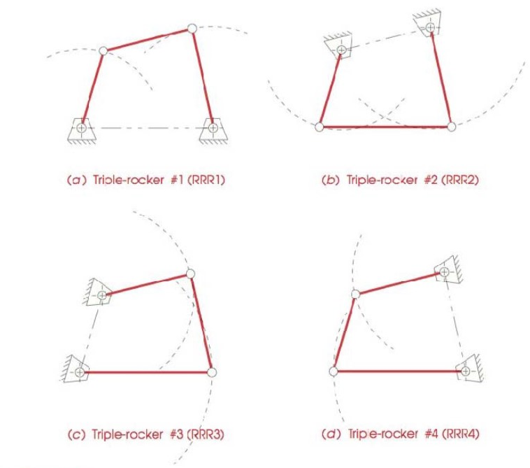

# Lecture_2

[TOC]
## 1. Kinematic Chain

is an assembly of links connected by means of pairs

- Locked Chain
- A Constrained Chain
- An Unconstrained Chain

## 2. Mobility

the mobility is the numbers of freedom

### Gruebler's Equation

$$
M=3(L-1)-2J_1-J_2
$$

Where:

- $M$: mobility
- $L$: number of links (**including ground**)
- $J_1$: number of 1 degree of freedom joints
- $J_2$: number of 2 degrees of freedom joints

**where k links connect at a single joint, it must be counted as k-1 joints**

### Summary: Mobility

- $M > 1$: maybe an unconstrained mechanism
- $M = 1$: a constrained mechanism
- $M = 0$: a statically determinate structure
- $M < 0$: a statically indeterminate structure

## 3. Paradoxes

Because the Gruebler criterion pays no attention to link sizes or shapes, it can give misleading results in the face of unique geometric configurations.

## 4. Inversion

an inversion is created by grounding a different link in the kinematic chain.

## 5. Grashof Conditions

Let:

$$
\begin{aligned}
    S &= length\;of\;shortest\;link\\[2ex]
    L &= length\;of\;longest\;link\\[2ex]
    P &= length\;of\;one\;remaining\;link\\[2ex]
    Q &= length\;of\;other\;remaining\;link
\end{aligned}
$$

If $S+L\leq P+Q$, then the linkage is Grashof 

- **Class I case,** $S+L<P+Q$

    *At least one link will be capable of making a full revolution with respect to the ground plane*

    Ground either link adjacent to the shortest: **Crank Rocker**

    Ground the shortest link adjacent to the shortest: **Double Crank**

    Ground the opposite link to the shortest: **Grashof Double Rocker**

- **Class II case,** $S+L>P+Q$

    All inversions will be **Triple Rockers**

- **Class III case,** $S+L=P+Q$

    All inversions will be either **Double Ranks** or **Crank Rockers**

