# Lecture_3

[TOC]

**Synthesis** and Analysis

_design or create a mechanism to give a certain motion_

## 1. Synthesis

### Qualitative Synthesis

the creation of potential solutions in the absence of a well-defined algorithm that configures or predicts the solution

### Type Synthesis

the definition of the proper type of mechanism best suited to the problem

### Dimensional Synthesis

the determination of the proportions (lengths) of the links necessary to
accomplish the desired motions

## 2. Function, Path and Motion Generation

### Function Generation

output motion is a defined mathematical function of the input motion

### Path Generation

output motion is a defined path along a set of $x\text{, }y$ points

### Motion Generation

output motion is a set of positions of a line defined as $x\text{, }y\text{, }\theta$ successive locations

## 3. Limiting Conditions

### Toggle

the toggle positions are determined by the collinearity of two moving links

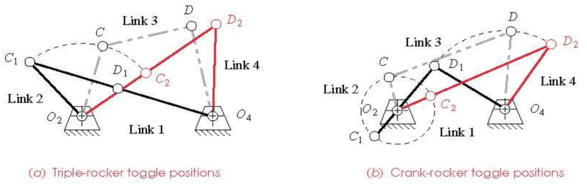

- it will not allow further input motion in one direction from one of its rocker links
- a different link will then have to be driven to get it out of toggle

### Transmission Angle

the transmission angle is defined as the acute angle between the output link and the coupler

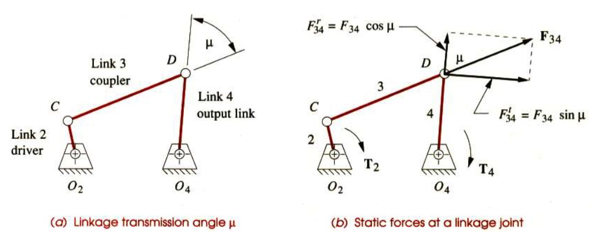

- varies continuously
- a measure of the quality of force and velocity transmission at the joint
- the optimal value of the transmission angle is 90 degree
- most machine designer try to keep the minimum TA above 40 degree
- when TA is less than 45 degree, the radial component is larger than the tangential component

## 4. Dimensional Synthesis

- Dimensional Synthesis

  a linkage is the determination of the proportions of the links necessary to accomplish the desired motions

- Two-Position Synthesis

  **rocker output** (pure rotation) and **coupler output** (complex motion)

### Example 1

**Basic Synthesis**

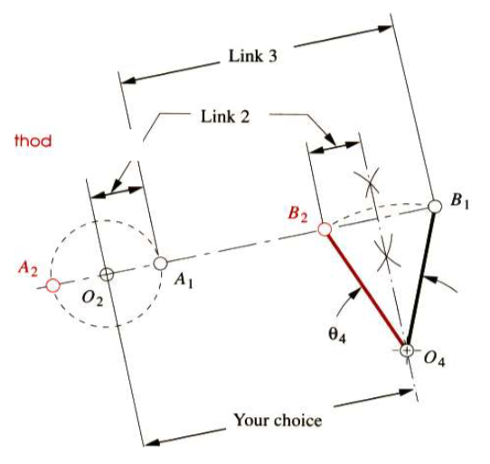

### Example 2

**Crank Rocker**

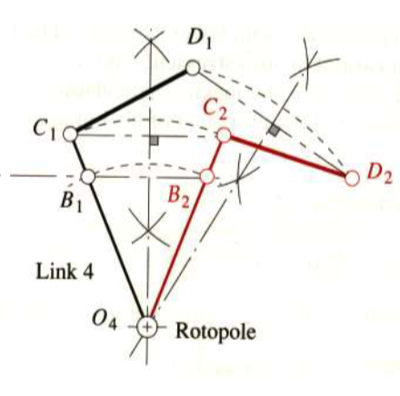

### Example 3

**Double Crank**

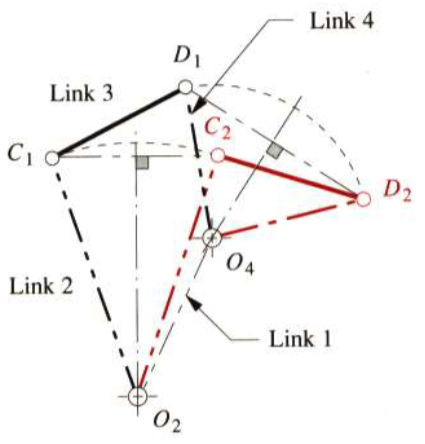

### Example 4

**Add a Dyad on Double Crank**

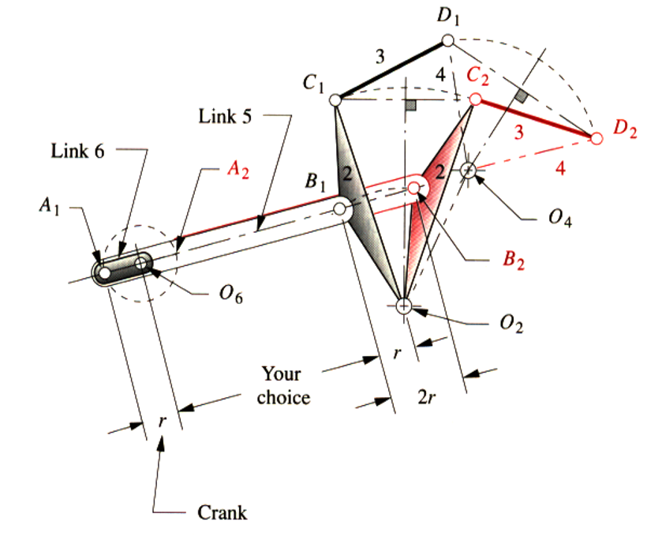

### Example 5

**Three-Position Synthesis**

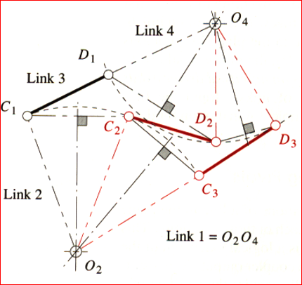

### Example 6

**Find Fixed Pivots of Three-Position Synthesis**

> **Key Point**: find the _fixed_ relative positions of the moving pivots

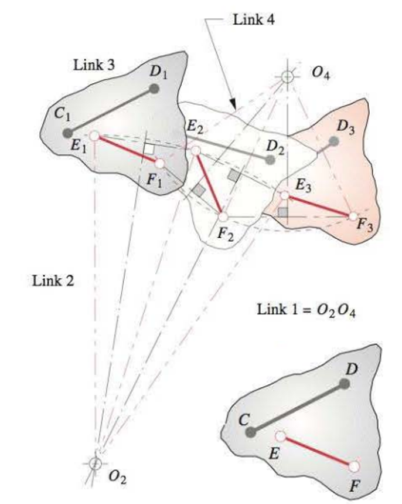

### Example 7 & 8

**Find the Fourbar Linkage Using the Fixed Pivots**

> **Key Point**: find the _fixed_ relative positions of $O_2O_4$ to bar $CD$

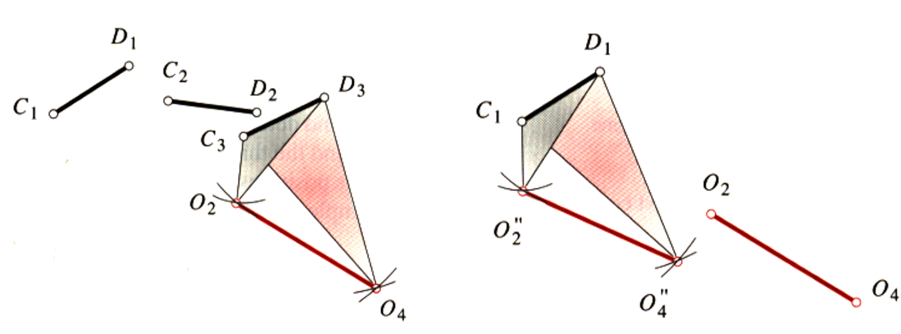

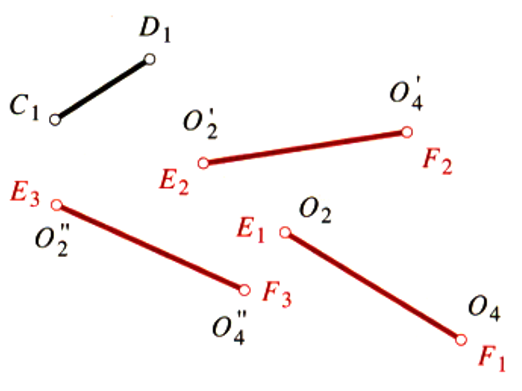

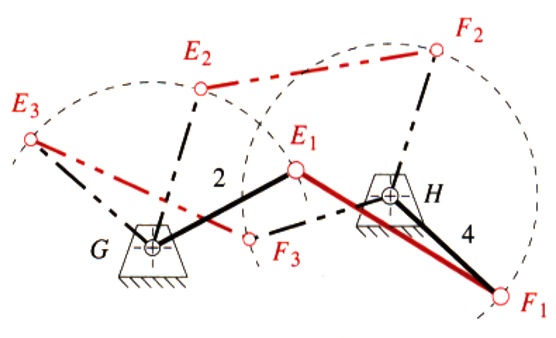

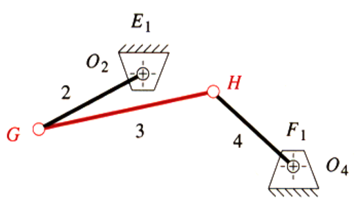

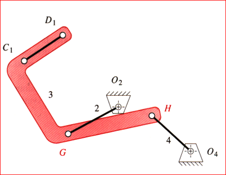

## 5 Quick Return Mechanisms

### Fourbar Quick-Return

time-ratio ($T_R$): the degree of quick-return of the linkage

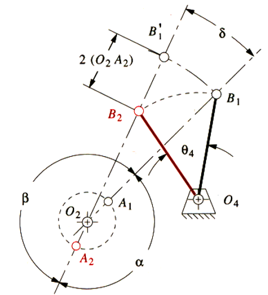

$$
\begin{aligned}
T_R&=\frac{\alpha}{\beta}\qquad\alpha+\beta=2\pi\\[2ex]
T_R&=\frac{\alpha}{2\pi-\alpha}\\[2ex]
\end{aligned}
$$

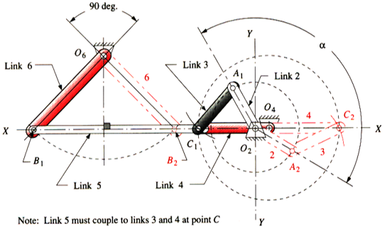

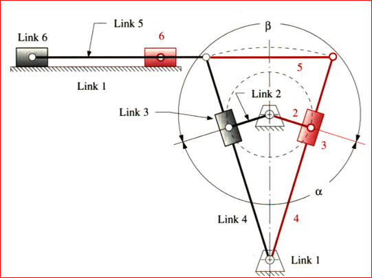
