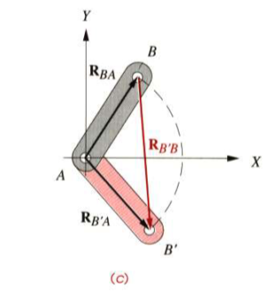

# Lecture_4

[TOC]

## Introduction

A **cam** is a specially shaped piece of metal arranged to move a follower in a controls fashion.

A **follower** is a link or linkage train that is

### Benefits of Cams

- Function Generation
- A degenerate form of a pure fourbar linkage
- Effective link length

## 8.1 Cam Terminology

### Classifications of Cam-follower Systems

#### Type of Follower Motion

- translating
  

- rotating
  

#### Type of Cam

- radical
- cylindrical
- three-dimensional

#### Type of Joint Closure

- force-closed
  

  

- form closed
  

#### Type of Follower

- curved (mushroom)
- flat-faces
- roller

#### Type of Cam

- radial cam *(the figures above are all radical cams)*
- axial cam

- three-dimensional cam

#### Type of Motion Constraints

- critical extreme position
- critical path motion

#### Type of Motion Constraints

- rise-fall
- rise-fall-dwell
- rise-dwell-fall-dwell

*dwell*: at zero displacement for 90 degrees (low dwell)
## 8.2 S V A J Diagrams

$$
\theta = \omega t
$$

## 8.3 Double-Dwell Cam Design Choosing S V A J Functions

### The Fundamental Law of Cam Design

**Thw cam function must be continuous through the first and second derivatives of displacement across the entire interval**

*The jerk function must be finite across the entire interval*

### Simple Harmonic Motion (SHM)

$$
\begin{aligned}
    s &= \frac{h}{2}[1-\cos{(\pi \frac{\theta}{\beta})}]\\[2ex]
    v &= \frac{\pi}{\beta}\frac{h}{2}\sin{(\pi \frac{\theta}{\beta})}\\[2ex]
    a &= \frac{\pi^2}{\beta^2}\frac{h}{2}\cos{(\pi\frac{\theta}{\beta})}\\[2ex]
    j &= -\frac{\pi^3}{\beta^3}\frac{h}{2}\sin{(\pi\frac{\theta}{\beta})}
\end{aligned}
$$
