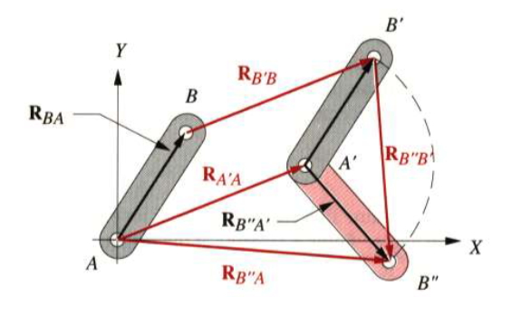
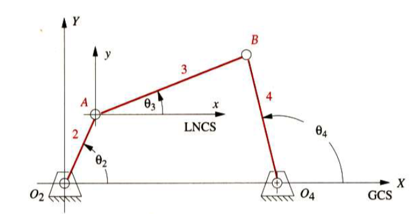
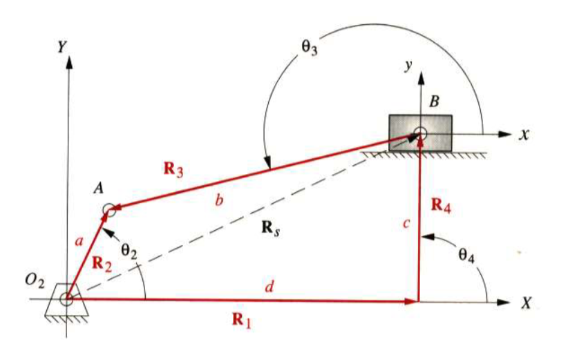

# Lecture_4

[TOC]

## Introduction

A **cam** is a specially shaped piece of metal arranged to move a follower in a controls fashion.

A **follower** is a link or linkage train that is

### Benefits of Cams

- Function Generation
- A degenerate form of a pure **fourbar linkage (oscillation)** or **fourbar slider-crank (translation)**
- Effective link length could **change** during the motion
- Easier to generate output function than a linkage
- More expensive to make than a linkage

## 8.1 Cam Terminology

### Classifications of Cam-follower Systems

#### Type of Follower Motion

- translating
  

- rotating
  

#### Type of Cam

- radial cam _(the figures above are all radical cams)_

  open radical cams are also called plate cams
- axial cam

  also called a face cam if open(force closed) and a cylindrical or barrel cam if grooved or ribbed(formed-closed)
  

- three-dimensional cam
  

#### Type of Joint Closure

- force-closed

  requires **an external force** be applied to the joint in order to keep cam and follower physically in contact

  

  

- form closed

  **closes the joint by geometry**

  

#### Type of Follower

- curved (mushroom)
- flat
- rolling
- sliding
  

#### Type of Motion Constraints

- critical extreme position

  - end points of motion are critical
  - path between endpoints is not critical

- critical path motion
  - the path between endpoints is critical
  - displacements, velocities, etc. may be specified
  - endpoints usually also critical
#### Type of Cam Motion Programs

- rise-fall
- rise-fall-dwell
- rise-dwell-fall-dwell

_dwell_: at zero displacement for 90 degrees (low dwell)

## 8.2 S V A J Diagrams

$$
\theta = \omega t
$$

## 8.3 Double-Dwell Cam Design Choosing S V A J Functions

### The Fundamental Law of Cam Design

**Thw cam function must be continuous through the first and second derivatives of displacement across the entire interval**

_The jerk function must be finite across the entire interval_

### Simple Harmonic Motion (SHM)

$$
\begin{aligned}
    s &= \frac{h}{2}[1-\cos{(\pi \frac{\theta}{\beta})}]\\[2ex]
    v &= \frac{\pi}{\beta}\frac{h}{2}\sin{(\pi \frac{\theta}{\beta})}\\[2ex]
    a &= \frac{\pi^2}{\beta^2}\frac{h}{2}\cos{(\pi\frac{\theta}{\beta})}\\[2ex]
    j &= -\frac{\pi^3}{\beta^3}\frac{h}{2}\sin{(\pi\frac{\theta}{\beta})}
\end{aligned}
$$

- Acceleration discontinuous
- Jerk is infinite

### Cycloidal Displacement

$$
\begin{aligned}
  s &= \frac{h}{\beta}\theta - \frac{h}{2\pi}\sin{(\frac{2\pi\theta}{\beta})}\\[2ex]
  v &= \frac{h}{\beta}(1-\cos(\frac{2\pi\theta}{\beta}))\\[2ex]
  a &= \frac{2\pi h}{\beta^2}\sin(\frac{2\pi \theta}{\beta})\\[2ex]
  j &= \frac{h(2\pi)^2}{\beta^3}\cos(\frac{2\pi \theta}{\beta})
\end{aligned}
$$

- valid cam design
- acceleration and velocity are higher than other functions
- one may seek to cut off the acceleration

### Combined Functions

cut a sine wave into three pieced and recombine them with a square wave

- lowest magnitude of peak acceleration of standard cam functions

### Polynomial Functions

