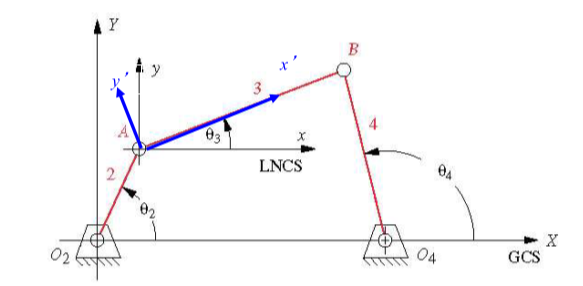
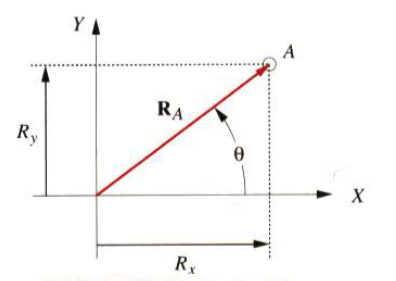

# Chapter 4

[TOC]

## Introduction

A principle goal of **kinematics analysis** is to determine the **acceleration** of all the moving parts in the assembly

And the **stress** in materials must be kept well under its operating conditions

To calculate the **stress**, the first thing we need to know is the **accelerations**

In order to calculate the **accelerations**, we must find the **positions** of all the links or elements in the mechanism.

## 4.1 Coordinate Systems

- GCS: Global Coordinate System $(X,Y)$
- LNCS: Local Non-Rotating Coordinate System $(x,y)$
- LRCS: Local Rotating Coordinate System $(x',y')$

All angles will be measured according to the right-hand rule.

## 4.2 Position and Displacement

### Position

- GCS
    

    - Polar form: $|R_A|\angle\theta$
    - Cartesian form: $R_x$,$R_y$

- LRCS
    

    - Polar form: $|R_A|\angle\phi$
    - Cartesian form: $R_x$, $R_y$

where $R_A = \sqrt{R_x^2+R_y^2}$ and $\theta = \arctan\Big(\frac{R_y}{R_x}\Big)$

### Displacement

$$
R_{AB} = R_B-R_A
$$

