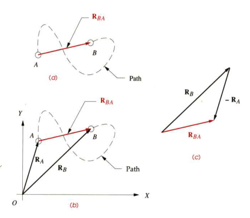
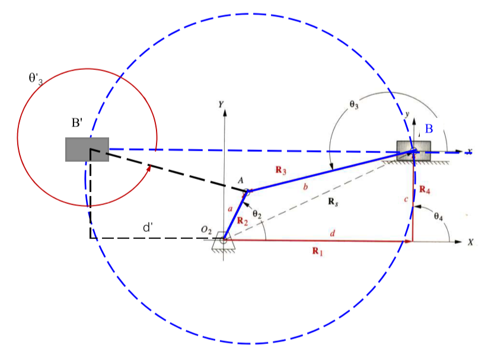
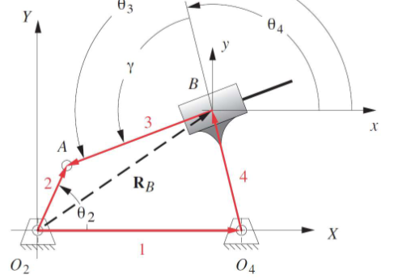

# Chapter 4

[TOC]

## Introduction

A principle goal of **kinematics analysis** is to determine the **acceleration** of all the moving parts in the assembly

And the **stress** in materials must be kept well under its operating conditions

To calculate the **stress**, the first thing we need to know is the **accelerations**

In order to calculate the **accelerations**, we must find the **positions** of all the links or elements in the mechanism.

## 4.1 Coordinate Systems

- GCS: Global Coordinate System $(X,Y)$
- LNCS: Local Non-Rotating Coordinate System $(x,y)$
- LRCS: Local Rotating Coordinate System $(x',y')$

All angles will be measured according to the right-hand rule.

## 4.2 Position and Displacement

### Position

- GCS
    

  - Polar form: $|R_A|\angle\theta$
  - Cartesian form: $R_x$,$R_y$

- LRCS
    

  - Polar form: $|R_A|\angle\phi$
  - Cartesian form: $R_x$, $R_y$

where $R_A = \sqrt{R_x^2+R_y^2}$ and $\theta = \arctan\Big(\frac{R_y}{R_x}\Big)$

### Displacement

$$
R_{AB} = R_B-R_A
$$

## 4.3 Basic Motion

### Translation

All points on the body have the same displacement

### Rotation

Different points in the body undergo different displacements and thus is a displacement difference between any two points chosen

$$
R_{B'B} = R_{B'A}-R_{BA}
$$

### Complex Motion

the complex motion combined of translation and rotation

$$
\begin{aligned}
    R_{B''B} &= R_{B'B}+R_{B''B'}\\[2ex]
    R_{A''A} &= R_{A'A}+R_{A''A'}
\end{aligned}
$$

## 4.4 Graphical Position Analysis of Linkages

the main idea of this part is using the graphical method to find the possible positions of given linkages and the input degress

### Example 1

**Graphically find all the possible $\theta_3$**

1. 根据给定$\theta_2$和$O_2A$长度画得杆件
2. 以$A$为圆心，$AB$长度为半径做圆
3. 以$O_4$为圆心，$O_4B$长度为半径做圆
4. 两圆相交位置即为$B$的可能位置，量取角度
   

### Example 2

**Graphically find all the possible $\theta_3$**

1. 根据给定$\theta_2$和$O_2A$长度画得杆件
2. 以$A$为圆心，$AB$长度为半径做圆
3. 圆交$B$所在水平线上两点即为$B$的不同位置，两区角度和长度

### Example 3

**Graphically find both open and crossed solutions for angles $\theta_3$ and $\theta_4$ and vector $R_B$**

1. 根据给定$\theta_2$和$O_2A$长度画得杆件
2. 以$O_4$为圆心，$O_4B$长度为半径做圆
3. 过点A做圆的两条切线，两个交点即为$B$的两个位置

## 4.5 to 4.9 Algebra Method to Solve Position Method

skipped ~~(Boring)~~

## 4.10 Transmission Angle

$$
\theta_{trans} =|\theta_3-\theta_4|
$$

if $\theta_{trans} > \frac{\pi}{2}$, $\theta_{trans} = \pi - \theta_{trans}$

**the extreme transmission angle**

$$
\begin{aligned}
    \mu_1 &= \arccos \frac{b^2+c^2-(d+a)^2}{2bc}\\[2ex]
    \mu_2 &= \arccos \frac{b^2+c^2-(d-a)^2}{2bc}\\[2ex]
\end{aligned}
$$

**for toggle position**

$$
\mu = \arccos \frac{(a+b)^2+c^2-d^2}{2c(a+b)}
$$

## 4.11 Toggle Positions

$$
\theta_{2toggle} = \arccos \Big[\frac{a^2+d^2-b^2-c^2}{2ad}\pm\frac{bc}{ad}\Big]\qquad 0\leq \theta_{2toggle}\leq \pi
$$