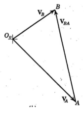
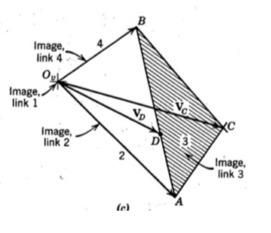
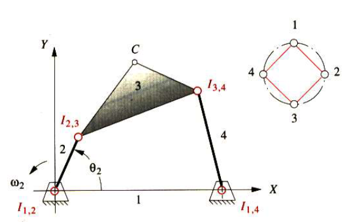
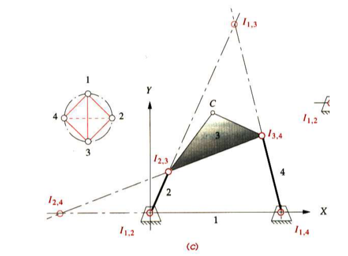
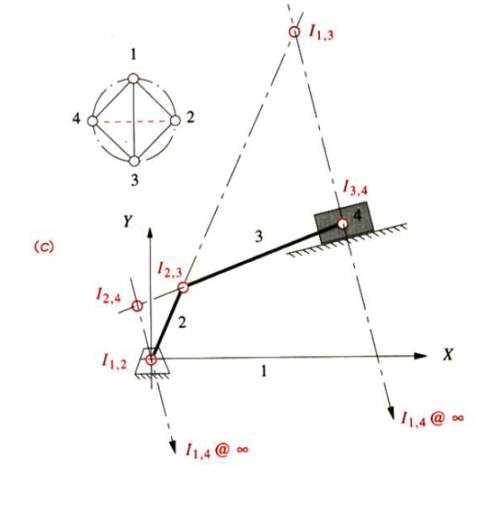
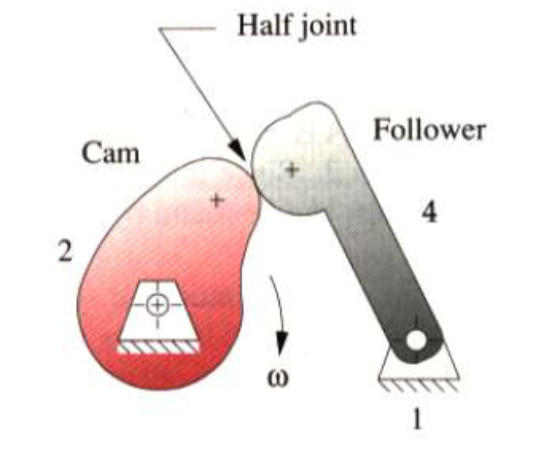
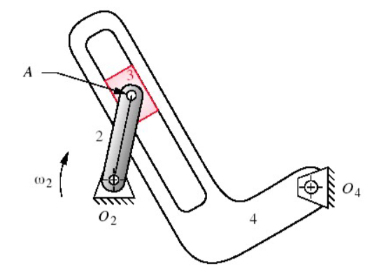

# Chapter 6

[TOC]

## Introduction

To determine the velocities of all links and points of interest in the mechanism

Several ways to solve velocity:

1. Manual graphical method
2. Analytical method: vector loop equation solution
3. Instant center of velocity

## 6.1 Definition of Velocity

$$
\omega = \frac{\mathrm{d}\theta}{\mathrm{d}t}\qquad \boldsymbol{V}=\frac{\mathrm{d}\boldsymbol{R}}{\mathrm{d}t}
$$

since $\boldsymbol{R} = Re^{j\theta}$

$$
V = \frac{\mathrm{d}\boldsymbol{R}}{\mathrm{d}t} = R\omega j e^{j\theta}
$$

and the substitution and addition of the velocities

$$
\begin{aligned}
    \boldsymbol{V}_{PA} &= \boldsymbol{V}_P-\boldsymbol{V}_A\\[2ex]
    \boldsymbol{V}_{P} &= \boldsymbol{V}_A+\boldsymbol{V}_{AP}\\[2ex]
\end{aligned}
$$

## 6.2 Graphical Velocity Analysis

**General Idea**:

1. 确定所求速度和输入速度的矢量关系式
2. 确定输入速度大小和关系式中各速度的方向
3. 写出 Magnitude-Direction 表,确定已知量和未知量
4. 根据上表作图
5. 循环上述流程直至求出解答

### Example 1

**Given $\theta_2$, $\theta_3$, $\theta_4$ and $\omega_2$, find $\omega_3$, $\omega_4$, $V_A$, $V_B$ and $V_C$ by graphical methods**

1. 求出已知量$V_A=\omega_2 |AO_2|$,方向为$\theta_2+180^{\circ}$
2. 写出矢量关系式$V_B=V_A+V_{BA}\qquad V_C=V_A+V_{CA}$
3. 完成 Magnitude-Direction 表,确定已知速度大小和已知速度的方向

   | Equation  | $V_B$ | $V_A$ | $V_{BA}$ | $V_C$ | $V_A$ | $V_{CA}$ |
   | :-------: | :---: | :---: | :------: | :---: | :---: | :------: |
   | Magnitude |   0   |   1   |    0     |   0   |   1   |    0     |
   | Direction |   1   |   1   |    1     |   1   |   1   |    1     |

4. 根据已知的大小和方向作图量取速度大小

5. 根据角速度定义求得对应速度的角速度

### Example 2

**Find $V_B$, $\omega_3$, $\omega_4$, $\omega_{32}$, $\omega_{43}$ and $V_C$**

1.  根据已知量求得$V_A=\omega_2|O_2A|$, 方向为$\theta_2+180^{\circ}$
2.  写出矢量关系式$V_B=V_A+V_{BA}$
3.  完成 Magnitude-Direction 表,确定已知速度大小和已知速度的方向

    | Equation  | $V_B$ | $V_A$ | $V_{BA}$ |
    | :-------: | :---: | :---: | :------: |
    | Magnitude |   0   |   1   |    0     |
    | Direction |   1   |   1   |    1     |

4.  根据上表作图,量取对应的速度大小
    

5.  写出矢量关系式$V_C=V_A+V_{CA}$, $V_C=V_B+V_{CB}$
6.  完成 Magnitude-Direction 表,确定已知速度大小和已知速度的方向

    | Equation  | $V_C$ | $V_A$ | $V_{CA}$ | $V_B$ | $V_{CB}$ |
    | :-------: | :---: | :---: | :------: | :---: | :------: |
    | Magnitude |   0   |   1   |    0     |   1   |    0     |
    | Direction |   0   |   1   |    1     |   1   |    1     |

7.  根据上表制图,量取对应速度的大小

8.  根据角速度求得对应速度的角速度

## 6.3 Instant Centers of Velocity

**Definition: a point, common to two bodies in plane motion, which pony has the same instantaneous velocity in each body**

the number of the instant centers

$$
C = \frac{n(n-1)}{2}
$$

**Kennedy's Rule:**

Any three bodies in plane motion will have exactly three instant centers, and **they will lie on the same straight line**

**Notation:**

瞬心图将各杆件视为点,瞬心则成了各点的连线,故而下标取相交杆件的序号

### Example 1

**Finding all instant centers for a fourbar linkage**

1. 标出杆件的序号,四个杆件的交点即为四个瞬心,其下标取作毗邻杆件的序号
2. 根据公式$C=\frac{n(n-1)}{2}=6$,可知仍要寻找剩余的两个瞬心
3. 画出瞬心图,可以知晓剩余两个瞬心为$I_{1,2}$和$I_{2,3}的连线$ (杆件 2)、$I_{1,4}$和$I_{3,4}的连线$ (杆件 4) 的交点和$I_{1,2}$和$I_{1,4}的连线$ (杆件 1)、$I_{2,3}$和$I_{3,4}的连线$ (杆件 3) 的交点
4. 延长对应的瞬心相交,得到对应的瞬心,其下标取连线瞬心的异或

### Example 2

**Finding all instant centers for a slider-crank linkage**

1. 标出各杆件序号,各杆件交点即为四个瞬心,其下标取作相交杆件的序号,注意: slider joint 瞬心视为一条垂直滑动平面的任意直线
2. 根据公式$C=\frac{n(n-1)}{2}=6$,可知仍要寻找剩余的两个瞬心
3. 画出瞬心图,可以知晓剩余两个瞬心为$I_{1,2}$和$I_{2,3}的连线$ (杆件 2)、$I_{1,4}$和$I_{3,4}的连线$的交点和$I_{1,2}$和$I_{1,4}的连线$、$I_{2,3}$和$I_{3,4}的连线$ (杆件 3) 的交点
4. 延长对应瞬心的连线相交,得到对应的瞬心,其下标取连线瞬心的异或

### Example 3

**Finding all instant centers for a cam-follower mechanism**

1. 由于该题是凸轮三杆机构,寻找等效杆长以画出等效的四杆机构、
2. 根据公式$C=\frac{n(n-1)}{2}$=3,可知总瞬心个数为 3,杆件 2 和杆件 4 与地面的交点为瞬心$I_{1,2}$和$I_{1,4}$,即还要寻找瞬心$I_{2,4}$
3. 画出瞬心图，可以知道$I_{2,4}$为$I_{1,2}$和$I_{1,4}的连线$ (杆件 1)、$I_{2,3}$和$I_{3,4}的连线$ (杆件 3) 的交点
4. 延长对应的瞬心连线相交,得到所求瞬心

**Notation**:

there's a tricky way to find the wanswer

## 6.4 Velocity Analysis with Instant Centers

using the definition of the instant centers, we could find a simpler way to find the solution of the Example 1 in 6.2

1. 求得点 A,B 的速度，寻找瞬心
2. 利用瞬心的定义和已知速度绘制一个直角三角形
3. 利用比例可以求得未知的速度

### Angular Velocity Ratio

the output angular velocity divided by the input angular velocity

For a fourbar mechanism

$$
m_V = \frac{\omega_4}{\omega_2}
$$

### Example 1

**Given the input $\omega_2$, lengths and angular of the links, find $v_4$**

$$
\begin{aligned}
    V_{A'}&=V_{B'}\\[2ex]
    (O_2A\sin{v}) \omega_2 &= (O_4A\sin{\mu})\omega_4\\[2ex]
    \frac{\omega_2}{\omega_4}&= \frac{O_4B'}{O_2A'}\\[2ex]
    m_V &=\frac{\omega_4}{\omega_2}=\frac{O_4I_{2,4}}{O_2I_{2,4}}
\end{aligned}
$$

### Example 2

**Given the input $\omega_2$, lengths and angular of the links, find $v_4$**

$$
v=v_{P_{24}} = \omega_2|P_{12}P_{24}|
$$

### Example 3

**In the following figure, given the length of all links, find the velocity of link 3**

$$
v = v_{P23} =\omega_2|P_{12}P_{23}|
$$

### Mechanical Advantage

$$
\begin{aligned}
    m_A &= \frac{F_{out}}{F_{in}}\\[2ex]
        &= \Big(\frac{\omega_{in}}{\omega_{out}}\Big)\Big(\frac{r_{in}}{r_{out}}\Big)
\end{aligned}
$$

## 6.5 Velocity of Slip

### Example

**Given $\theta_2$, $\theta_3$, $\theta_4$ and $\omega_2$, find $\omega_3$, $\omega_4$ and $V_A$ by graphical method**

1. 根据输入角速度，求得杆件2对A的线速度
2. 正交投影线速度，求出slip分量和trans分量
3. 又因A点可视作绕点$O_4$旋转，确定其速度方向
4. 同样正交投影速度，其trans分量应当与原先相同，可求得new slip分量
5. 可知A点的slip分量即为上述两个slip分量相减

## 6.6 Velocity Analysis by Unit Vector Method

**Unit vector method**

1. State the location of the XY location
2. State the orientation of the XY axis
3. State the location of the xy origin
4. State the orientation of the xy origin
5. Define the direction to be used for the $i$,$j$ vectors

### Example 1

**Use analytical method to find $v_B$, $\omega_3$ and $\omega_4$**

1. 写出点B的速度矢量关系式: $\boldsymbol{V_B} = \boldsymbol{V_A}+V+\omega\times\boldsymbol{R}$
2. 根据杆B旋转方向，将矢量表达式写成以i、j为方向向量的式子: $\boldsymbol{V_B}=V_B(\cos{3^\circ}i+\sin{3^\circ}j)$, $\boldsymbol{V_A} = V_A(\cos{37^\circ}i+\sin{37^\circ}j)$, $\omega\times R = \omega |O_2A| \vec{k}\times \vec{i}=\omega |O_2A|j$
3. 利用$i$,$j$分量分别相等列出等式