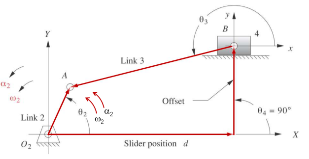
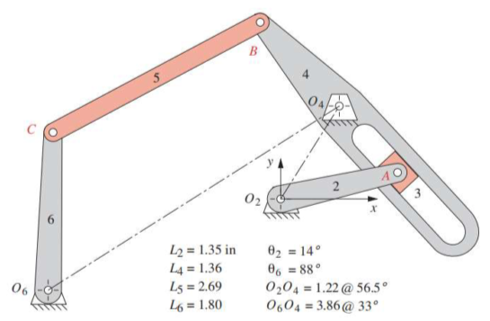
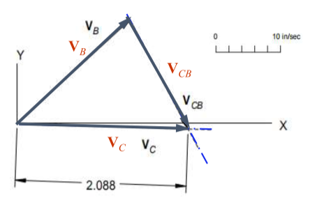
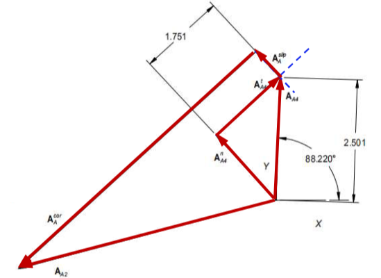
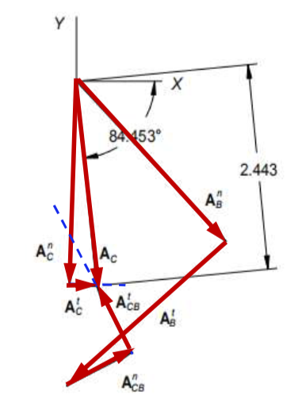
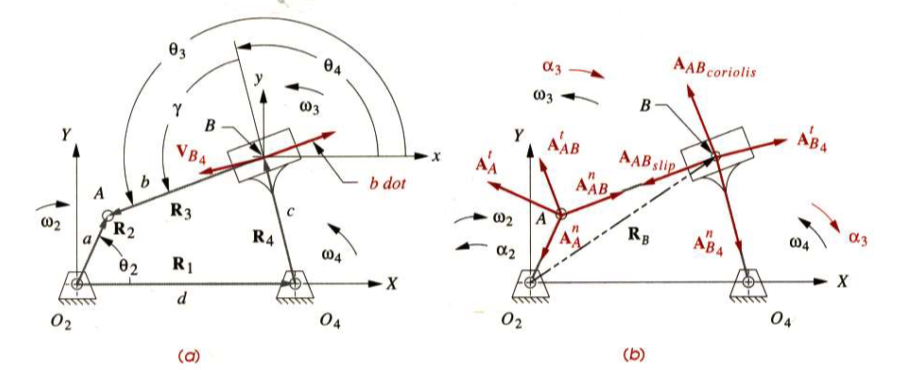
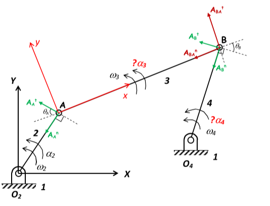

# Chapter 7

[TOC]

## Introduction

We need to know the accelerations to calculate the dynamic forces from $F=ma$

The manual graphical method and the analytical solution for accelerations

## 7.1 Definition of Acceleration

### Definition

the rate of change of velocity with respect to time

$$
\alpha = \frac{\mathrm{d}\omega}{\mathrm{d}t}\qquad \boldsymbol{A}=\frac{\mathrm{d}\boldsymbol{V}}{\mathrm{d}t}
$$

take the basic model for consideration

$$
\boldsymbol{R}_{PA} = p e^{j\theta}\\[2ex]
\boldsymbol{V}_{PA} = \omega j p e^{j\theta}\\[2ex]
\boldsymbol{A}_{PA} = jp (\alpha e^{j\theta}+j\omega^2 e^{j\theta})=-\omega^2pe^{j\theta}+j\alpha p e^{j\theta}\\[2ex]
\boldsymbol{A}_{PA} = \boldsymbol{A}_{PA}^n+\boldsymbol{A}_{PA}^t
$$

### Acceleration Difference

Two points in the same body

$$
\boldsymbol{A}_P = \boldsymbol{A}_A+\boldsymbol{A}_{PA}\\[2ex]
(\boldsymbol{A}_P^t+\boldsymbol{A}_P^n)=(\boldsymbol{A}_A^t+\boldsymbol{A}_A^n)+(\boldsymbol{A}_{PA}^t+\boldsymbol{A}_{PA}^n)\\[2ex]
$$

### Relative Acceleration

Two points in different bodies

$$
\boldsymbol{A}_{PA} = \boldsymbol{A}_P - \boldsymbol{A}_A
$$

## 7.2 Graphical Acceleration Analysis

To solve any acceleration analysis problem graphically, we need only three equations

$$
(\boldsymbol{A}_P^t+\boldsymbol{A}_P^n)=(\boldsymbol{A}_A^t+\boldsymbol{A}_A^n)+(\boldsymbol{A}_{PA}^t+\boldsymbol{A}_{PA}^n)\\[2ex]
|\boldsymbol{A}^t|= A^t = r\alpha\\[2ex]
|\boldsymbol{A}^n|= A^n = r\omega^2\\[2ex]
$$

### Coriolis Acceleration

for the position vector $\boldsymbol{R}_P$

$$
\boldsymbol{R}_P = pe^{j\theta_2}
$$

we can simply get the velocity expression

$$
\boldsymbol{V}_P = p\omega_2e^{j\theta_2}+\dot{p}e^{j\theta_2}
$$

take a further step

$$
\boldsymbol{A}_P = p\alpha_2je^{j\theta_2}-p\omega_2^2e^{j\theta_2}+2\dot{p}\omega_2je^{j\theta_2}+\ddot{p}e^{j\theta_2}
$$

### Example 1

**Graphical Acceleration Analysis for One Position of a Fourbar Linkage**

Given $\theta_2$, $\theta_3$, $\theta_4$, $\omega_2$, $\omega_3$, $\omega_4$, $\alpha_2$, find $\alpha_3$, $\alpha_4$, $\boldsymbol{A}_A$, $\boldsymbol{A}_B$ and $\boldsymbol{A}_C$ by graphically method

1. 写出矢量关系式: $(\boldsymbol{A}_B^t+\boldsymbol{A}_B^n)=(\boldsymbol{A}_A^t+\boldsymbol{A}_A^n)+(\boldsymbol{A}_{AB}^t+\boldsymbol{A}_{AB}^n)$
2. 根据已知量完成 Magnitude-Direction 表， 确定已知量和未知量

   | Equation  | $\boldsymbol{A}_B^n$ | $\boldsymbol{A}_B^t$ | $\boldsymbol{A}_A^n$ | $\boldsymbol{A}_A^t$ | $\boldsymbol{A}_{AB}^n$ | $\boldsymbol{A}_{AB}^t$ |
   | :-------: | :------------------: | :------------------: | :------------------: | :------------------: | :---------------------: | :---------------------: |
   | Magnitude |          1           |          0           |          1           |          1           |            1            |            0            |
   | Direction |          1           |          1           |          1           |          1           |            1            |            1            |

3. 根据已知量和上表制图

4. 利用图中长度的比例来求出未知量

### Example 2

**Graphically Acceleration Analysis for Fourbar Crank-Slider**

**Given the value of $\theta_2$, $\theta_3$, $\theta_4$, $\omega_2$ and $\alpha_2$**

1. 列出加速度的矢量关系式: $\boldsymbol{A}_B=(\boldsymbol{A}_A^t+\boldsymbol{A}_A^n)+(\boldsymbol{A}_{AB}^t+\boldsymbol{A}_{AB}^n)$
2. 根据已知量完成 Magnitude-Direction 表
   | Equation | $\boldsymbol{A}_B$ |$\boldsymbol{A}_A^n$ | $\boldsymbol{A}_A^t$ | $\boldsymbol{A}_{AB}^n$ | $\boldsymbol{A}_{AB}^t$ |
   | :-------: | :------------------: | :------------------:| :------------------: | :------------------: | :---------------------: |
   |Magnitude|0|1|1|1|0|
   |Magnitude|1|1|1|1|1|
3. 根据上表制图
   

4. 根据比例尺量取图中长度

### Example 3

**Graphically Acceleration Analysis for Slider**

Given $\omega_2$, $\theta_2$, use a graphical method to calculate the accelerations of points A,B and C for the position shown

1. 沿杆 4 分解 A 点的速度，其垂直杆件 4 分量除以$|O_2|A$便为杆件 4 的角速度
2. 接下来则是求四杆机构 4、5、6、地面的各杆件速度
3. 列出矢量关系式$\vec{V_C} = \vec{V_B}+\vec{V_{BC}}$，列 Magnitude-Direction 表格，画图求得 C 点速度,顺带求出杆件 5、6 的角速度
   |Equation|$\vec{V_C}$|$\vec{V_B}$|$\vec{V_{BC}}$|
   |:--:|:--:|:--:|:--:|
   |Magnitude|0|1|0|
   |Direction|1|1|1|
   

4. 写出 A 点的加速度矢量关系式:$A_2^n = A_4^n+A_4^t+A_4^{cor}+A_4^{slip}$, 根据已知量列出 Magnitude-Direction 表，并作图求得杆件 4 的角加速度
   | Equation | $\boldsymbol{A}_2^n$ |$\boldsymbol{A}_4^n$ | $\boldsymbol{A}_4^t$ | $\boldsymbol{A}_{4}^{cor}$ | $\boldsymbol{A}_{4}^{slip}$ |
   | :-------: | :------------------: | :------------------:| :------------------: | :------------------: | :---------------------: |
   |Magnitude|1|1|0|1|0|
   |Magnitude|1|1|1|1|1|
   

5. 取杆件 4、5、6、地面组成的四杆机构，进行加速度分析，列出在 C 点的加速度矢量关系式: $(\boldsymbol{A}_C^t+\boldsymbol{A}_C^n)=(\boldsymbol{A}_B^t+\boldsymbol{A}_B^n)+(\boldsymbol{A}_{BC}^t+\boldsymbol{A}_{BC}^n)$, 列出 Magnitude-Direction 表，并作图求得杆件 6 的加速度
   | Equation | $\boldsymbol{A}_C^n$ | $\boldsymbol{A}_C^t$ | $\boldsymbol{A}_B^n$ | $\boldsymbol{A}_B^t$ | $\boldsymbol{A}_{BC}^n$ | $\boldsymbol{A}_{BC}^t$ |
   | :-------: | :------------------: | :------------------: | :------------------: | :------------------: | :---------------------: | :---------------------: |
   | Magnitude | 1 | 0 | 1 | 1 | 1 | 0 |
   | Direction | 1 | 1 | 1 | 1 | 1 | 1 |
   

## 7.3 Analytical Solutions For Acceleration Analysis

### Example 1

**Find the acceleration of the four-bar linkage**

$$
R_2+R_3-R_4-R_1 = 0\\[2ex]
ae^{j\theta_2}+be^{j\theta_3}-ce^{j\theta_4}-de^{j\theta_4} = 0\\[2ex]
a\omega_2e^{j\theta_2}+b\omega_3e^{j\theta_3}-c\omega_4e^{j\theta_4} = 0\\[2ex]
(-a\omega_2^2e^{j\theta_2}+a\alpha_2je^{j\theta_2})+(-b\omega_3^2e^{j\theta_3}+b\alpha_3je^{j\theta_3})-(-c\omega_4^2e^{j\theta_4}+c\alpha_4je^{j\theta_4} ) = 0\\[2ex]
\boldsymbol{A}_A+\boldsymbol{A}_{BA}-\boldsymbol{A}_B = 0
$$

separate the real parts and imaginary parts, get alpha accelerations

$$
\alpha_3 = \frac{CD-AF}{AE-BD}\\[2ex]
\alpha_3 = \frac{CE-BF}{AE-BD}\\[2ex]
$$

where $A = c\sin\theta_4$, $B = b\sin\theta_3$, $C = a\alpha_2\sin\theta_2+a\omega_2^2\cos\theta_2+b\omega_3^2\cos\theta_3-c\omega_4^2\cos\theta_4$

$D = c\cos\theta_4$, $E = b\cos\theta_3$ and $F = a\alpha_2\cos\theta_2-a\omega_2^2\sin\theta_2-b\omega_3^2\sin\theta_3+c\omega_4^2\sin\theta_4$

### Example 2

**Find the acceleration of the fourbar slider-crank**

$$
R_3-R_3-R_4-R_1 = 0\\[2ex]
ae^{j\theta_2}-be^{j\theta_3}-ce^{j\theta_4}-de^{j\theta_1} = 0\\[2ex]
ja\omega_2e^{j\theta_2}-jb\omega_3e^{j\theta_3}-\dot{d} = 0\\[2ex]
(ja\alpha_2e^{j\theta_2}-a\omega_2^2e^{j\theta_2})-(b\alpha_3je^{j\theta_3}-b\omega_3^2e^{j\theta_3})-\ddot{d} = 0\\[2ex]
$$

separate the real and imaginary parts, we can get

$$
\alpha_3 = \frac{a\alpha_2\cos\theta_2-a\omega_2^2\sin\theta_2+b\omega_3^2\sin\theta_3}{b\cos\theta_3}\\[2ex]
\ddot{d} = -a\alpha_2\sin\theta_2-a\omega_2^2\cos\theta_2+b\alpha_3\sin\theta_3+b\omega_3^2\cos\theta_3
$$

### Example 3

**Find the acceleration of the inverted crank slider**

$$
R_2-R_3-R_4-R_1 = 0\\[2ex]
ae^{j\theta_2}-be^{j\theta_3}-ce^{j\theta_4}-de^{j\theta_1} = 0\\[2ex]
j\omega_2e^{j\theta_2}-jb\omega_3e^{j\theta_3}-\dot{b}e^{j\theta_3}-jc\omega_4e^{j\theta_4} = 0\\[2ex]
(a\alpha_2je^{j\theta_2}-a\omega_2^2e^{j\theta_2})-(b\alpha_3je^{j\theta_3}-b\omega_3^2e^{j\theta_3}+2\dot{b}\omega_3je^{j\theta_3}+\ddot{b}e^{j\theta_3})-(c\alpha_4je^{j\theta_4}-c\omega_4^2e^{j\theta_4}) = 0
$$

and we know that $\omega_3 = \omega_4$ and $\alpha_3 = \alpha_4$

separate the imaginary and real parts, we can get the solution

$$
\alpha_4 = \frac{a[\alpha_2\cos(\theta_3-\theta_2)+\omega_2^2\sin(\theta_3-\theta_2)]+c\omega_4^2\sin(\theta_4-\theta_3)-2\dot{b}\omega_3}{b+c\cos(\theta_3-\theta_4)}\\[2ex]
\ddot{b} = \frac{a\omega_2^2[b\cos(\theta_3-\theta_2)+c\cos(\theta_4-\theta_2)]+a\alpha_2[b\sin(\theta_2-\theta_3)-c\sin(\theta_4-\theta_2)]+2\dot{b}c\omega_4\sin(\theta_4-\theta_3)-\omega_4^2[b^2=c^2=2bc\cos(\theta_4-\theta_3)]}{b+c\cos(\theta_3-\theta_4)}
$$

## 7.4 Unit Vector Method for Acceleration Analysis

Acceleration of point P

$$
\boldsymbol{A}_P = \boldsymbol{A}_O+\boldsymbol{A}+2\omega\times \boldsymbol{V}+\alpha\times \boldsymbol{R}+\omega\times(\omega\times \boldsymbol{R})
$$

$\boldsymbol{A}_P$: the absolute acceleration of point P

$\boldsymbol{A}_O$: the absolute acceleration of the origin of moving axis system

$\boldsymbol{A}$: the relative acceleration of point P with respect to the moving axis system

$\boldsymbol{V}$ and $\boldsymbol{R}$: the velocity and position vectors of point P with respect to the moving axis system

$\omega$ and $\alpha$: the angular velocity and acceleration of the moving axis system

### Two Points on One Rigid Body

$\boldsymbol{V} = 0$ and $\boldsymbol{A} = 0$

$$
A_P^n+A_P^t = A_O^n+A_O^t+A_{PO}^n+A_{PO}^t
$$

**Basic Four Bar Mechanism**

$$
A_B^n+A_B^t=A_A^n+A_A^t+A_{BA}^n+A_{BA}^t
$$

| Equation  |  $A_B^n$   |   $A_B^t$    |  $A_A^n$   |   $A_A^t$    | $A_{BA}^n$ | $A_{BA}^t$ |
| :-------: | :--------: | :----------: | :--------: | :----------: | :--------: | :--------: |
| Magnitude |     1      |      0       |     1      |      1       |     1      |     0      |
| Direction | $B\to O_4$ | $\perp O_4B$ | $A\to O_2$ | $\perp O_2A$ |  $-i$  | $(+?-)j$ |

### Two Coincident Points on Two Rigid Bodies

$R = 0$

$$
A_P^n+A_P^t = A_O^n+A_O^t+A+A_{Coriolis}
$$

**Sliding Connection**

$$
A_{A_2}^n+A_{A_2}^t = A_{A_4}^n+A_{A_4}^t+A_{slip}+2\omega_4\times V_{slip}
$$

| Equation  |  $A_{A_2}^n$   |   $A_{A_2}^t$    |  $A_{A_4}^n$   |   $A_{A_4}^t$    | $A_{slip}$ | $\omega_4\times V_{slip}$ |
| :-------: | :--------: | :----------: | :--------: | :----------: | :--------: | :--------: |
| Magnitude |     1      |      1       |     1      |      0       |     0      |     1      |
| Direction | $A\to O_2$ | $\perp O_2A$ | $A\to O_4$ | $\perp O_4A$ |  $(+?-)i$  | $j$ |