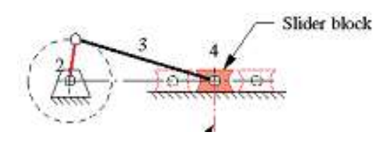
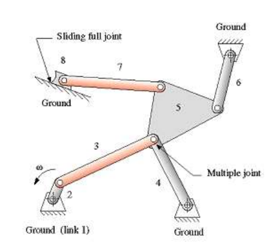
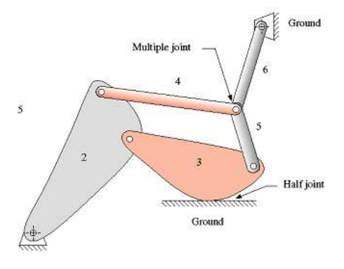
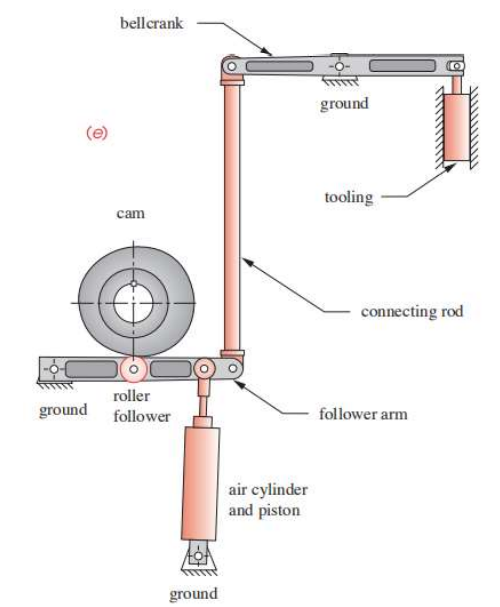
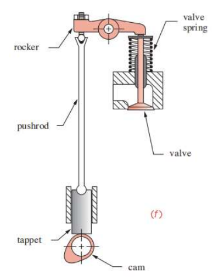
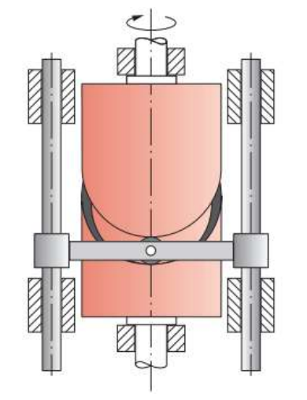

# EX_2

[TOC]

**Notation: the ground is always the first link in DOF questions**

## EX 2.1

an ordinary question on DOF of cam

**Notation: the touch of the cam and the follower is a two freedom joint**

$L = 3$, $J_1 = 2$ and $J_2 = 1$

$DOF = 3(L-1)-2J_1-J_2 = 1$

## EX 2.2

an ordinary question on DOF of crank-slider

**Notation: the touch between the slider block and the ground is a one freedom joint, and the slider block is also a link**

$L = 4$, $J_1 = 4$ and $J_2 = 0$

$DOF = 3(L-1)-2J_1-J_2 = 1$

## EX 2.3

an ordinary question on DOF of multiple joint and the sliding joint

$L = 8$, $J_1 = 10$ and $J_2 = 0$

$DOF = 3(L-1)-2J_1-J_2 = 1$

## EX 2.4

an ordinary question on DOF of multiple joint and the joint on cam

$L = 6$, $J_1 = 7$ and $J_2 = 1$

$DOF = 3(L-1)-2J_1-J_2 = 0$

> it's really hard to form a general model from the particular existences

## EX 2.5

tricky problem in the homework 1

**Link**:

1. Ground
2. Follower Arm
3. **Roller Follower**
4. **Cam**
5. Piston
6. Air Cylinder
7. Connecting Rod
8. Bell Crank
9. **Short Slider** (lies in the end of the bell crank)
10. Tooling (sliding on the ground)

**Full Joint**:

1. joint of $L_1$ and $L_2$
2. joint of $L_2$ and $L_3$
3. joint of $L_4$ and $L_1$
4. joint of $L_3$ and $L_4$ (the rotation is the pure rotation)
5. joint of $L_2$ and $L_5$
6. joint of $L_5$ and $L_6$ (sliding joint)
7. joint of $L_6$ and $L_1$
8. joint of $L_2$ and $L_7$
9. joint of $L_7$ and $L_8$
10. joint of $L_8$ and $L_1$
11. joint of $L_8$ and $L_9$ (sliding joint)
12. joint of $L_9$ and $L_{10}$
13. joint of $L_{10}$ and $L_1$

**Notation: if the rotation between the cam and other links is the pure rotation, then the joint between them is the full joint**

**Half Joint**

None

$DOF = 3(L-1)-2J_1-J_2 = 1$

## EX 2.6

tricky problem in homework

**Link**

1. Ground
2. Cam
3. Tappet
4. Push Rod
5. Rocker
6. Valve

**Full Joint**

1. joint of $L_1$ and $L_2$
2. joint of $L_3$ and $L_1$ (sliding joint)
3. joint of $L_3$ and $L_4$
4. joint of $L_4$ and $L_5$
5. joint of $L_5$ and $L_1$
6. joint of $L_6$ and $L_1$ (sliding joint)

**Half Joint**

1. joint of $L_2$ and $L_3$
2. joint of $L_5$ and $L_6$

$DOF = 3(L-1)-2J_1-J_2 = 1$

## EX 2.7

the hard question in homework

**Link**

1. Ground
2. Cams (cams fixed in the same position)
3. Roller Follower 1
4. Roller Follower 2
5. Rocker Arm 1
6. Rocker Arm 2
7. Valve 1
8. Valve 2

**Full Joint**

1. joint of $L_1$ and $L_2$
2. joint of $L_2$ and $L_3$
3. joint of $L_2$ and $L_4$
4. joint of $L_3$ and $L_5$
5. joint of $L_4$ and $L_6$
6. joint of $L_5$ and $L_1$
7. joint of $L_6$ and $L_1$
8. joint of $L_7$ and $L_1$ (sliding joint)
9. joint of $L_8$ and $L_1$ (sliding joint)

**Half Joint**

1. joint of $L_5$ and $L_7$
2. joint of $L_6$ and $L_8$

$DOF = 3(L-1)-2J_1-J_2 = 1$

## EX 2.8

a tricky question in the homework

**Notation: It can be simplified as the rotation of cam and the Up and down reciprocating movement of connecting rod with the attached roller follower**

**Link**

1. Ground
2. Cam
3. Roller Follower
4. Connecting Bar

**Full Joint**

1. joint of $L_1$ and $L_2$
2. joint of $L_2$ and $L_3$
3. joint of $L_3$ and $L_4$
4. joint of $L_4$ and $L_1$

**Half Joint**

None

$DOF = 3(L-1)-2J_1-J_2 = 1$

