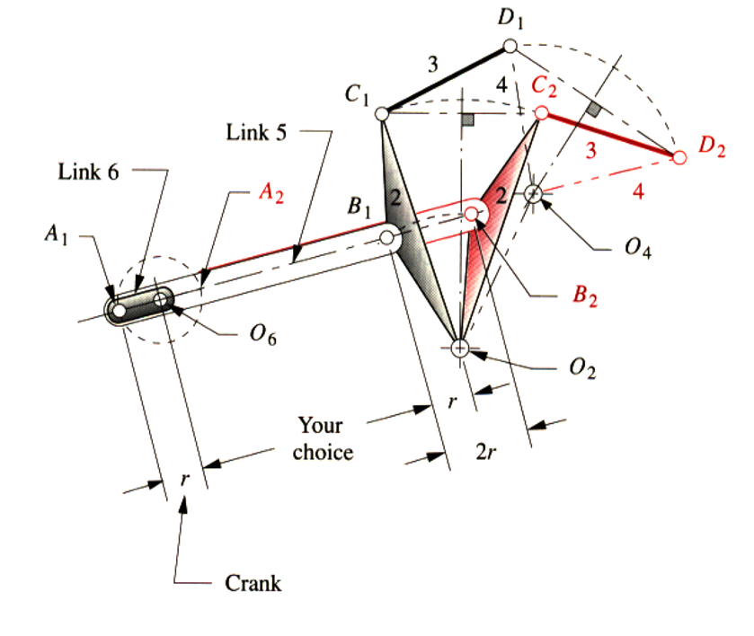

# EX_3

[TOC]

**Notation: the Grashof condition $(S+L\leq P+Q)$ must be verified after painting**

## EX 3.1

**Basic Synthesis**

1. 确定$B$的两个极限位置，记为$B_1$和$B_2$
2. 做$B_1B_2$垂直平分线,在其上选取合适位置为$O_4$
3. 量取$B_1B_2$距离
4. 在$B_1B_2$延长线上选择合适位置为$O_2$，以$B_1B_2$距离为直径做圆，交延长线上两点极为对应的$A_1$和$A_2$

## EX 3.2

**Crank Rocker**

1. 确定$C$和$D$的端点位置,记为$C_1$和$C_2$,$D_1$和$D_2$
2. 做$C_1C_2$和$D_1D_2$的垂直平分线，记其交点为$O_4$
3. 以$C_1C_2$的垂直平分线在$O_4C_1$和$O_4C_2$上寻找合适两点$B_1B_2$
4. 量取$B_1B_2$距离
5. 在$B_1B_2$延长线上选择合适位置为$O_2$，以$B_1B_2$距离为直径做圆，交延长线上两点极为对应的$A_1$和$A_2$

## EX 3.3

**Double Crank**

1. 确定$C$和$D$的端点位置,记为$C_1$和$C_2$,$D_1$和$D_2$
2. 做$C_1C_2$的垂直平分线，在其上选择合适的点为$O_2$
3. 做$D_1D_2$的垂直平分线，在其上选择合适的点为$O_4$

## EX 3.4

**Add a Dyad on Double Crank**

1. 确定$C$和$D$的端点位置,记为$C_1$和$C_2$,$D_1$和$D_2$
2. 做$C_1C_2$的垂直平分线，在其上选择合适的点为$O_2$
3. 做$D_1D_2$的垂直平分线，在其上选择合适的点为$O_4$
4. 以$C_1C_2$的垂直平分线在$O_2C_1$和$O_2C_2$上寻找合适两点$B_1B_2$
5. 量取$B_1B_2$距离
6. 在$B_1B_2$延长线上选择合适位置为$O_6$，以$B_1B_2$距离为直径做圆，交延长线上两点极为对应的$A_1$和$A_2$

## EX 3.5

**Three-Position Synthesis**

1. 确定$C$和$D$的端点位置,记为$C_1$,$C_2$和$C_3$,$D_1$,$D_2$和$D_3$
2. 做$C_1C_2$和$C_2C_3$垂直平分线,其交点记为$O_2$
3. 做$D_1D_2$和$D_2D_3$垂直平分线,其交点记为$O_4$

## EX 3.6

**Three-Position Synthesis using different moving pivots than $CD$**

1. 寻找相对$CD$位置固定的杆$EF$,记其三个位置的点为$E_1$,$E_2$和$E_3$,$F_1$,$F_2$和$F_3$
2. 做$E_1E_2$和$E_2E_3$垂直平分线,其交点记为$O_2$
3. 做$F_1F_2$和$F_2F_3$垂直平分线,其交点记为$O_4$

## EX 3.7

**Invert $CD$ use specified fixed pivots**

1. 以$C_3D_3$为底边，分别作$O_2$和$O_4$为顶点的三角形
2. 以$C_2D_2$和$C_1D_1$为底边，做$C_3D_3O_2$和$C_3D_3O_4$的全等三角形，其顶点分别记为$O_2'$，$O_4'$和$O_2''$和$O_4''$
3. 连接$O_2'O_4'$和$O_2''O_4''$

## EX 3.8

**Find the moving pivots for three positions and specified fixed pivots**

1. 以$C_3D_3$为底边，分别作$O_2$和$O_4$为顶点的三角形
2. 以$C_2D_2$和$C_1D_1$为底边，做$C_3D_3O_2$和$C_3D_3O_4$的全等三角形，其顶点分别记为$O_2'$，$O_4'$和$O_2''$和$O_4''$
3. 连接$O_2'O_4'$和$O_2''O_4''$

4. 做$E_1E_2$和$E_2E_3$垂直平分线,其交点记为$G$
5. 做$F_1F_2$和$F_2F_3$垂直平分线,其交点记为$H$
6. 选取$E_1$和$F_1$,将两点视作地面，重新绘制机构

## EX 3.9

**Design a quick return linkage for specified time ratio**

1. 确定两个端点位置，记为$B_1$和$B_2$
2. 做$B_1B_2$垂直平分线,在其上选取合适位置为$O_4$
3. 选取$B_2$,作任意直线
4. 在该直线上选取一点记为$O_2$，使得$\angle B_1O_2B_2 = \delta = \frac{\beta-\alpha}{2}$

## EX 3.10

**Design a quick return with $90^\circ$ rocker motion**

~~Sorry that I didn't get the meaning of the problem~~